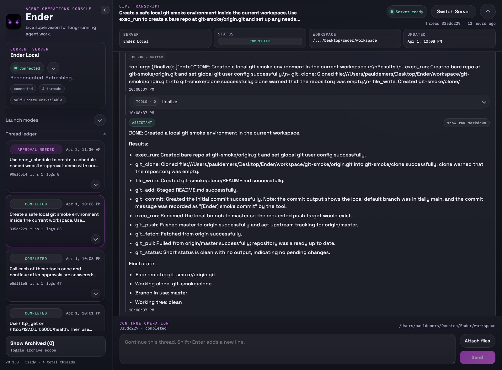
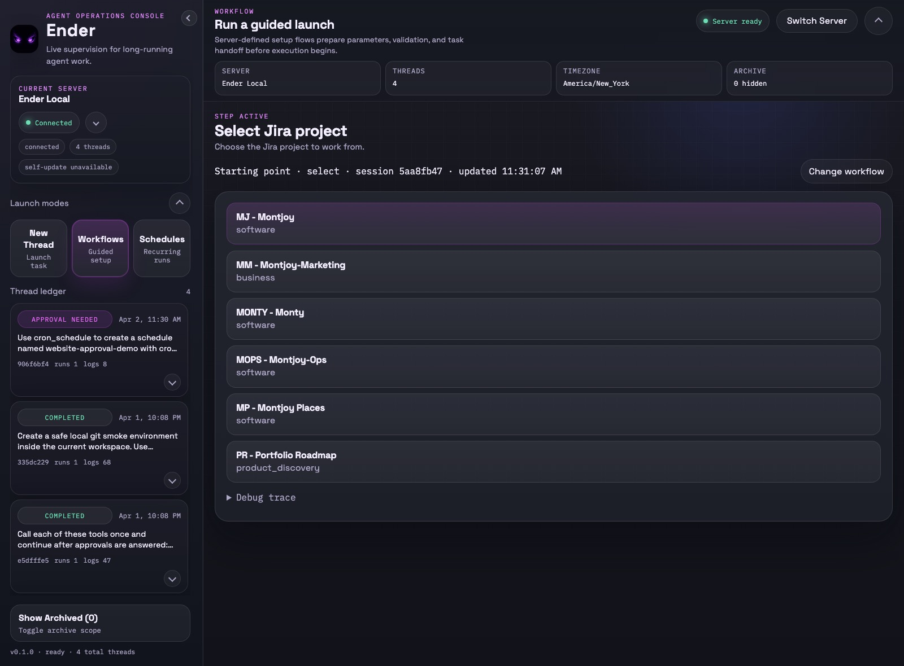
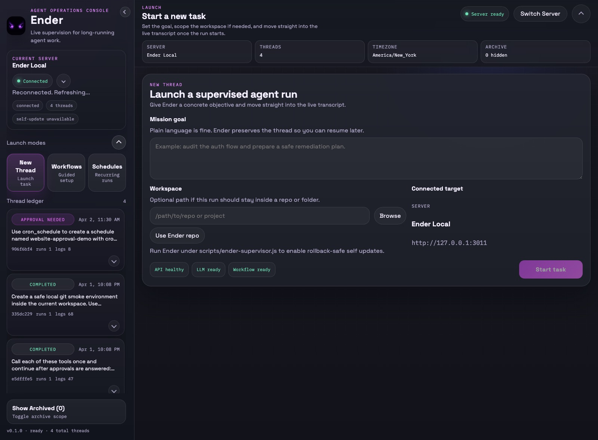
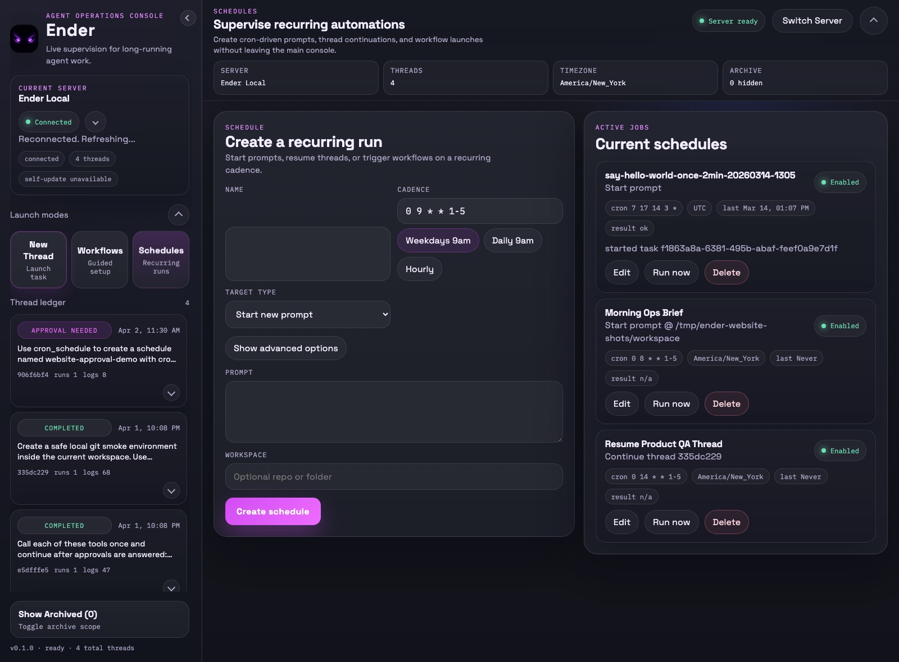

# Ender

<p align="center">
  
</p>

Ender is a local-first agent runtime with a React/Electron control surface, guided workflows, recurring schedules, and a tool-calling execution loop built on LangChain.

It is designed for operator-driven work: launch a task against a workspace, watch the live transcript, approve sensitive actions, and keep thread history on disk.

## What Ender Does

- Runs an iterative tool-calling loop until the task is completed, stalled, canceled, or reaches a configured step cap.
- Exposes a local API for threads, live logs, approvals, workflows, schedules, health, and workspace browsing.
- Adds a persisted global task ledger that can queue work, auto-dispatch tasks, and track which thread completed each item.
- Ships a React UI and an Electron desktop app built from the same frontend.
- Persists threads, schedules, and workflow sessions to JSON on disk so they survive server restarts.
- Supports guided workflows that gather structured inputs before starting work.
- Supports recurring automation for three targets: start a new prompt, continue an existing thread, or run a workflow on a cron cadence.
- Works with multiple LLM backends: OpenAI, AWS Bedrock, Azure OpenAI, Ollama, and ACP-compliant agents (Claude Code, etc.)
- Includes tools for files, shell execution, git, GitHub, GitLab, Jira, Confluence, Google Drive, email, browser capture, schedules, and child threads.



## Core Functionality at a Glance

### Runtime and orchestration

| Area | Summary |
| --- | --- |
| Task runtime | Iterative LangChain-based tool loop with persistence, approvals, SSE logs, reruns, and follow-up prompts. |
| Workflows | Server-defined state machines rendered by the UI from generic `form`, `select`, and `complete` steps. |
| Schedules | Cron-backed automation for `prompt`, `thread`, and `workflow` targets. |
| Global task ledger | Persists queue entries, auto-dispatches work when slots are free, and links completed work back to the responsible thread. |
| Self-update | Optional supervised self-edit / verify / restart / rollback flow for Ender’s own repo. |
| Persistence | Threads, schedules, and workflow sessions are stored on disk as JSON. |

### Tooling categories

| Category | Included functionality |
| --- | --- |
| Workspace tools | Read, write, list, and existence checks for workspace files. |
| Local execution | Shell command execution with approval gating for risky commands. |
| Web and browser | Raw HTTP fetch, web search, readable page extraction, image ingest, and rendered page snapshots. |
| Source control | Git clone/fetch/status/add/commit/pull/push plus GitHub and GitLab repo / PR / MR operations. |
| Work management | Jira issue lookup, board issue listing, transitions, and comments. |
| Knowledge systems | Confluence search/read/create/update and Google Drive search/read/export/upload/update. |
| Communication | IMAP email listing/reading and SMTP email sending. |
| Automation | Current time lookup plus schedule create/list/delete. |
| Delegation and continuity | Child thread spawn/status/await plus task ledger tools for facts, todos, and completion. |

### Built-in workflow

| Workflow | Purpose | Scheduling |
| --- | --- | --- |
| `jira_to_repo_task` | Select a Jira issue, clone a repository, choose commit/push and Jira outcome policy, then start a task in the repo. | Supported |



Sensitive actions stay operator-visible instead of disappearing into a black box.

For the full functionality tables, see [docs/reference/functionality-matrix.md](docs/reference/functionality-matrix.md).

## Project Layout

```text
ender/
├── src/        # API server, runtime loop, managers, tools, workflows
├── ui/         # React UI + Electron packaging
├── docs/       # Tutorials, references, architecture notes
├── knowledge/  # Fast onboarding docs for future threads
├── threads/    # Persisted task snapshots
├── schedules/  # Persisted cron schedules
├── task-ledger/ # Persisted global task ledger entries
├── workflow-sessions/ # Persisted interactive workflow sessions
└── workspace/  # Default working directory for cloned/generated work
```

## Quickstart

### Prerequisites

- Node.js 20+
- npm
- At least one configured LLM backend

### Install

```bash
npm install
cp .env.example .env
```

Running `npm install` from the repository root installs both the API/runtime and [`ui/`](ui/) through npm workspaces.

### Configure

Pick a backend in `.env`:

- `LLM_BACKEND=openai`
- `LLM_BACKEND=bedrock`
- `LLM_BACKEND=azure`
- `LLM_BACKEND=ollama`

Then fill in the matching credentials. For the default OpenAI setup, the minimum is:

```env
LLM_BACKEND=openai
OPENAI_API_KEY=...
OPENAI_MODEL=gpt-4.1-mini
```

### Run

```bash
npm run dev
```

This starts:

- API: [http://localhost:3000](http://localhost:3000)
- UI: [http://localhost:5173](http://localhost:5173)



## Knowledge Base for Future Threads

Start here for fast repo onboarding:

- [knowledge/README.md](knowledge/README.md)
- [knowledge/quick-start-for-agents.md](knowledge/quick-start-for-agents.md)
- [knowledge/change-playbooks.md](knowledge/change-playbooks.md)
- [knowledge/glossary.md](knowledge/glossary.md)
- [knowledge/troubleshooting.md](knowledge/troubleshooting.md)

Ender’s system prompt also instructs future threads to check repo-local guidance early, especially `knowledge/` and common files like `README.md`, `docs/README.md`, `tasks.md`, `TASKS.md`, `soul.md`, `SOUL.md`, `AGENTS.md`, `agent.md`, `instructions.md`, `notes.md`, and `context.md` when relevant.

### Supervised Self-Update Mode

To let Ender edit and safely restart its own repo, start the API under the external supervisor:

```bash
npm run start:supervised
```

This mode:

- injects `ENDER_SUPERVISOR_URL` and `ENDER_SUPERVISOR_TOKEN` into the child server
- enables self-update tools for tasks running against the Ender repo root
- supports rollback checkpoints plus verification before promotion

Recommended self-update flow:

1. Launch a task with the Ender repo as the workspace.
2. Call `self_update_checkpoint_create` before editing.
3. Make the code changes.
4. Call `self_update_apply` to run `npm run verify`, restart under supervision, and roll back on failure.
5. After reconnect, inspect the result with `self_update_operations` or `GET /self-update/operations`.

### Quality Gates

```bash
npm test
npm run typecheck
npm run verify
```

- `npm test` runs the backend regression suite.
- `npm run typecheck` runs the targeted TypeScript check for the migrated runtime slice.
- `npm run verify` runs tests, typecheck, backend syntax checks, and the UI production build.

## Contributing and Releases

Ender uses a `dev`-based workflow. There is no separate long-lived `main` branch for normal development or releases.

Contributors should:

1. Branch from `dev`.
2. Use Git flow-style branch names that describe the work:
   - `feat/short-feature-name`
   - `bug/short-bug-name`
   - `doc/short-doc-change`
   - `chore/short-maintenance-change`
3. Open a pull request back into `dev`.
4. Run the relevant quality gates before requesting review. For broad changes, prefer `npm run verify`.

Releases are cut by tagging a known-good commit on `dev`. Release tags are the source of truth for published versions; no release branch is required unless a future maintenance need makes one necessary.

### Versioning

The repository version is stored in [`VERSION`](VERSION) and mirrored into the server package, UI package, lockfiles, and UI runtime version module.

To update every component version:

```bash
npm run version:set -- 0.1.1
```

To verify that all version metadata is synchronized:

```bash
npm run version:check
```

The server exposes its version through `GET /health` as `app.version`. The UI exposes its own build version in the current server details and compares it with the connected server version.

## Desktop App

The desktop app lives in [`ui/`](ui/) and packages the same React UI with Electron.

After the root install step above, the `ui` dependencies are already installed.

```bash
cd ui
npm run electron:dev
```

Packaging commands:

```bash
npm run electron:pack
npm run electron:dist
```

Current build targets:

- macOS: `dmg`
- Windows: `nsis`
- Linux: `AppImage`

## Docker

From the repository root:

```bash
docker compose up --build
```

The compose stack includes:

- `Dockerfile.api` for the API/runtime
- [`ui/Dockerfile`](ui/Dockerfile) for the frontend
- bind mounts for `./threads`, `./workspace`, `./schedules`, and `./workflow-sessions`

Published ports:

- API: `3000`
- UI: `5173`



## Configuration

### Core Runtime

- `PORT`: API port. Default `3000`.
- `AGENT_WORKDIR`: default working directory for generated files and cloned repos. Default `./workspace`.
- `AGENT_WORKSPACE_BASE`: root used by the workspace picker. Default `..`.
- `AGENT_THREADS_DIR`: thread persistence directory. Default `./threads`.
- `AGENT_SCHEDULES_DIR`: schedule persistence directory. Default `./schedules`.
- `AGENT_TASK_LEDGER_DIR`: global task-ledger persistence directory. Default `./task-ledger`.
- `AGENT_WORKFLOW_SESSIONS_DIR`: workflow session persistence directory. Default `./workflow-sessions`.
- `AGENT_SELF_ROOT`: repo root allowed for self-update tools. Default current working directory.
- `AGENT_MAX_STEPS`: optional hard limit on model/tool loop iterations.
- `AGENT_STALL_LIMIT`: repeated-iteration cutoff. Default `4`. Set `0` to disable.
- `AGENT_TASK_LEDGER_POLL_INTERVAL_MS`: how often Ender refreshes the global task ledger and checks for finished linked threads. Default `15000`. Set `0` to disable polling.
- `AGENT_TASK_LEDGER_MAX_AUTO_AGENTS`: maximum number of ledger-driven tasks Ender auto-starts concurrently. Default `0` (manual dispatch only).
- `AGENT_AUTO_RESTART_INTERRUPTED_THREADS`: when `true`, interrupted `running` or `awaiting_approval` threads auto-restart after server boot for all workspaces. Default `false`.
- Ender self-root threads opt into interrupted-thread auto-restart by default even when `AGENT_AUTO_RESTART_INTERRUPTED_THREADS` is unset or `false`.
- `AGENT_SELF_UPDATE_VERIFY`: verification command run by the supervisor before restart. Default `npm run verify`.
- `AGENT_SELF_UPDATE_TIMEOUT_MS`: health-wait timeout after restart or rollback. Default `90000`.
- `ENDER_SUPERVISOR_URL`: supervisor control URL injected when using `npm run start:supervised`.
- `ENDER_SUPERVISOR_TOKEN`: supervisor auth token injected when using `npm run start:supervised`.

### Shared Contracts

- Shared schedule/workflow contract enums live in [`shared/contracts.json`](shared/contracts.json).
- Backend schema wrappers live in [`src/shared/contracts.js`](src/shared/contracts.js).
- The UI imports the same contract definitions for workflow step and schedule target handling.

### Readiness Tips

- `GET /health` reports missing configuration for LLM, Jira, GitHub, browser capture, email, and workflow prerequisites.
- The UI server summary now surfaces setup hints directly from that readiness payload.
- Interactive workflow sessions are persisted to disk and can be resumed after a server restart from the workflow panel.

### LLM Backends

OpenAI:

- `OPENAI_API_KEY`
- `OPENAI_MODEL`

AWS Bedrock:

- `AWS_REGION`
- `BEDROCK_MODEL_ID`

Azure OpenAI:

- `AZURE_OPENAI_API_KEY`
- `AZURE_OPENAI_API_DEPLOYMENT_NAME`
- `AZURE_OPENAI_API_INSTANCE_NAME` or `AZURE_OPENAI_BASE_PATH`
- `AZURE_OPENAI_API_VERSION`

Ollama:

- `OLLAMA_BASE_URL`
- `OLLAMA_MODEL`

ACP (Agent Client Protocol):

- `ACP_COMMAND` — the agent binary to spawn (e.g. `claude-code`)
- `ACP_ARGS` — CLI args passed to the agent (default: `acp`)

The ACP backend runs an external ACP-compliant agent as a subprocess. When the agent requests permissions (file read/write, shell commands), Ender routes them through its own tool layer and approval system. This lets you use agents like Claude Code as the LLM backend while Ender handles tool execution, approvals, logging, and persistence.

Example:
```env
LLM_BACKEND=acp
ACP_COMMAND=claude-code
ACP_ARGS=acp
```

ACP agents also support LLM profiles for different agent binaries or configurations.

### SCM and Knowledge Sources

GitHub:

- `GITHUB_TOKEN`
- optional `GITHUB_BASE_URL`

GitLab:

- `GITLAB_TOKEN`
- optional `GITLAB_BASE_URL`

Jira:

- `JIRA_BASE_URL`
- `JIRA_EMAIL`
- `JIRA_API_TOKEN`

Confluence:

- `CONFLUENCE_BASE_URL`
- `CONFLUENCE_EMAIL`
- `CONFLUENCE_API_TOKEN`

Google Drive:

- `GOOGLE_DRIVE_ACCESS_TOKEN`

### Email

SMTP send:

- `SMTP_HOST`
- `SMTP_PORT`
- `SMTP_SECURE`
- `SMTP_USER`
- `SMTP_PASS`
- optional `SMTP_FROM`

IMAP read:

- `IMAP_HOST`
- `IMAP_PORT`
- `IMAP_SECURE`
- `IMAP_USER`
- `IMAP_PASS`
- optional `IMAP_MAILBOX`

## Main User Flows

### 1. Start a Direct Task

Use the main composer to send a prompt and optionally choose a workspace. Ender starts a thread, streams logs over SSE, and pauses for UI approval when a tool requires it.

### 2. Launch a Guided Workflow

Ender currently ships one built-in workflow: `jira_to_repo_task`.

It walks through:

1. Select Jira project
2. Select Jira board
3. Select issue
4. Clone repository
5. Choose commit/push policy
6. Choose final Jira action
7. Start a task in the cloned repository

### 3. Create a Schedule

Schedules are persisted cron jobs. A schedule can:

- start a new prompt
- continue an existing thread
- run a workflow with stored inputs

### 4. Run the Desktop App

Use Electron during local operations when you want a dedicated desktop window, OS-specific packaging, and local icon/install assets.

## API Overview

Health and discovery:

- `GET /health`
- `GET /workspaces`
- `GET /filesystem/directories?path=/optional/absolute/path`

Threads:

- `GET /tasks`
- `POST /tasks`
- `GET /tasks/:id`
- `POST /tasks/:id/messages`
- `POST /tasks/:id/terminate`
- `POST /tasks/:id/rerun`
- `DELETE /tasks/:id`
- `GET /tasks/:id/logs?from=0`
- `GET /tasks/:id/stream`
- `POST /tasks/:id/approvals/:approvalId`

Workflows:

- `GET /workflows`
- `POST /workflows/:id/sessions`
- `GET /workflow-sessions/:id`
- `POST /workflow-sessions/:id/advance`
- `POST /workflow-sessions/:id/back`

Schedules:

- `GET /schedules`
- `POST /schedules`
- `PUT /schedules/:id`
- `POST /schedules/:id/run`
- `DELETE /schedules/:id`

Self-update:

- `GET /self-update/status`
- `GET /self-update/operations`
- `GET /self-update/operations/:id`

## Operational Notes

- Thread snapshots are persisted to disk in `threads/`.
- Workflow sessions are persisted to disk in `workflow-sessions/` unless created in `scheduled_run` mode.
- On server restart, tasks that were `running` or `awaiting_approval` are either reloaded as `error` and annotated as interrupted, or auto-restarted if the task or config opted into restart behavior.
- Ender self-root threads auto-restart on interruption by default.
- `DELETE /tasks/:id` can optionally delete the task workspace if it is an eligible child workspace and not in use by another thread.
- `git_push` and schedule deletion are approval-gated through the UI.
- `browser_snapshot_page` requires Playwright plus a Chromium binary in the runtime environment.
- The health endpoint reports backend and integration readiness, including whether the Jira workflow is currently runnable.

## Documentation

Start here:

- [Documentation index](docs/README.md)
- [Knowledge base index](knowledge/README.md)
- [Functionality matrix](docs/reference/functionality-matrix.md)
- [First task tutorial](docs/tutorials/first-task.md)
- [Jira workflow tutorial](docs/tutorials/jira-workflow.md)
- [Schedules tutorial](docs/tutorials/schedules.md)
- [Desktop app tutorial](docs/tutorials/desktop-app.md)
- [Custom workflow guide](docs/guides/custom-workflow.md)
- [Workflow UI step schema reference](docs/reference/workflow-step-schema.md)
- [Architecture overview](docs/architecture/overview.md)

## Workflow Development

To add a workflow:

1. Copy [`src/workflows/workflowTemplate.js`](src/workflows/workflowTemplate.js).
2. Implement `createInitialState`, `getCurrentStep`, and `advance`.
3. Register it in [`src/workflows/index.js`](src/workflows/index.js).

Workflow UI is generated from the step object returned by `getCurrentStep(session)`. See [Workflow UI step schema reference](docs/reference/workflow-step-schema.md).

## Release Checklist Notes

Before publishing publicly, confirm:

- `.env` is not committed
- provider credentials are removed from local examples
- `threads/`, `schedules/`, `workflow-sessions/`, and `workspace/` do not contain sensitive data
- desktop packaging assets are the intended release icons

---

This project was developed independently by Paul Demers
outside the scope of any employment and without the use
of employer resources or confidential information.
