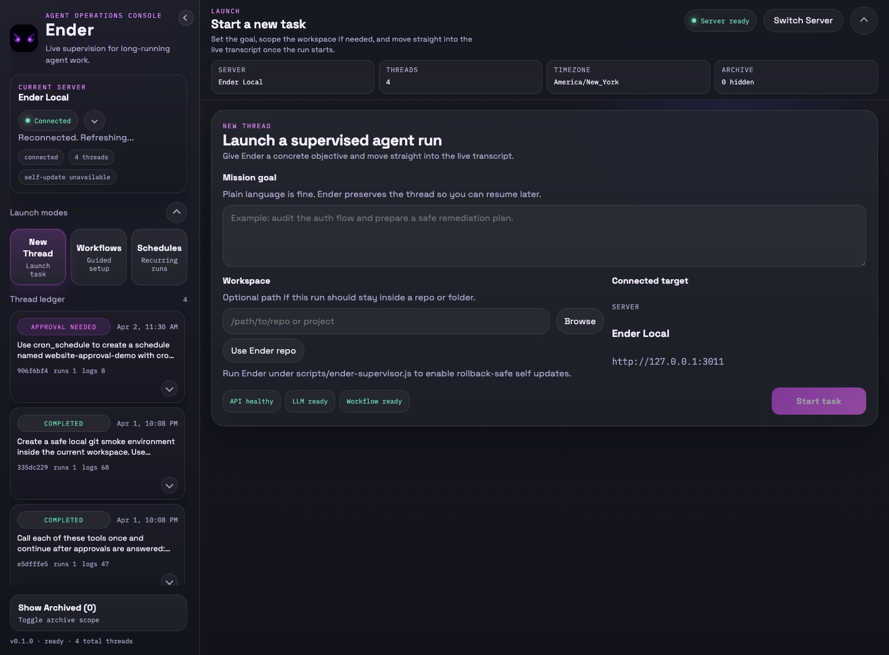

# Ender Documentation

This is the maintained entry point for operating, extending, deploying, and releasing Ender. Code and automated tests remain the runtime source of truth; the records linked here explain the supported behavior and verification boundary.

## Operate Ender

Start with the path that matches the job:

1. [Run your first task](tutorials/first-task.md) to install Ender, connect a backend, launch a thread, and read the live transcript.
2. [Use the Jira to repo workflow](tutorials/jira-workflow.md) for guided issue-to-workspace setup.
3. [Create a recurring schedule](tutorials/schedules.md) or use the task ledger for durable queued work.
4. [Troubleshoot Ender](guides/troubleshooting.md) when connection, readiness, launch, editor, workflow, schedule, or persistence behavior is unexpected.

The primary navigation calls these destinations **New thread**, **Workflows**, **Schedules**, and **Task ledger**. Server switching and readiness diagnostics live in the server-connections dialog.

## Deploy and Release

- [Run and package the desktop app](tutorials/desktop-app.md)
- [Release readiness matrix](../RELEASE_READINESS.md)
- [Release candidate review](../RELEASE_CANDIDATE_REVIEW.md)
- [Direct API and stream compatibility](../API_CONTRACTS.md)
- [Persistence and migration policy](../PERSISTENCE.md)

`RELEASE_READINESS.md` is the authority for what has actually been exercised on the current host, the exact smoke commands, and the checks that still require another platform, credentials, signing identity, or deployed environment.

## Extend Ender

- [Create a custom workflow](guides/custom-workflow.md)
- [Workflow UI step schema](reference/workflow-step-schema.md)
- [Functionality matrix](reference/functionality-matrix.md)
- [Targeted typechecking boundary](../TYPECHECKING.md)

## Architecture

- [System overview](architecture/overview.md)
- [Runtime loop and execution lifecycle](architecture/runtime-loop.md)
- [Workflows and schedules](architecture/workflows-and-schedules.md)
- [Frontend ownership and UI contracts](../FRONTEND_ARCHITECTURE.md)
- [Backend API and SSE contracts](../API_CONTRACTS.md)
- [Persisted-record contracts](../PERSISTENCE.md)

## Developer Continuity

The [`knowledge/`](../knowledge/) directory is a code-navigation and change-safety aid for future development threads. It supplements this maintained user/deployment path; it is not a separate operator manual.

## Historical and Planning Material

The following files remain useful context but are not release instructions or current runtime contracts:

- [Agentic spec](agentic-spec.md)
- [UI enhancement backlog](ui-enhancement-backlog.md)
- [Website planning and copy](website/implementation-checklist.md)

When these notes disagree with code, tests, the architecture records above, or the release-readiness matrix, use the maintained records and current code.
