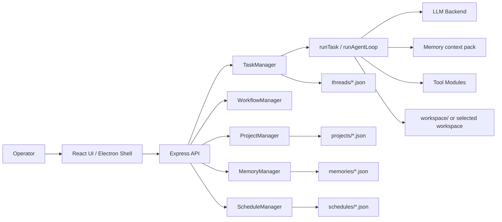

# Architecture Overview

Ender is split into three major surfaces:

- the API/runtime server in `src/`
- the React/Electron operator UI in `ui/`
- persisted task and schedule state on disk

## High-level component map

## Core responsibilities

### API layer

[`src/api/app.js`](../../src/api/app.js) exposes REST endpoints for:

- threads
- approvals
- workflow sessions
- schedules
- projects
- memories
- readiness and workspace browsing

### Task runtime

[`src/runtime/taskManager.js`](../../src/runtime/taskManager.js) owns:

- thread lifecycle
- log fanout and SSE
- approval resolution
- persistence to disk
- reruns and follow-up prompts
- per-thread model profile, project, and memory-mode metadata

### Project layer

[`src/runtime/projectManager.js`](../../src/runtime/projectManager.js) owns reusable project records:

- project names and aliases
- repo URLs and resource links
- local workspace paths
- workspace preparation by cloning the configured repo when missing

Threads can attach a `projectId`; project workspaces are protected from thread-delete workspace cleanup.

### Memory layer

[`src/runtime/memoryManager.js`](../../src/runtime/memoryManager.js) owns durable global, project, and thread memories. `runTask(...)` asks it for a bounded context pack based on the thread's `memoryMode`, project, and current goal. Memory records remain separate from prompt text so they can be searched, edited, archived, or loaded selectively.

### Workflow layer

[`src/workflows/workflowManager.js`](../../src/workflows/workflowManager.js) owns:

- workflow definitions
- in-memory workflow sessions
- step serialization for the UI
- back navigation
- scheduled workflow replay

### Schedule layer

[`src/runtime/scheduleManager.js`](../../src/runtime/scheduleManager.js) owns:

- cron registration through `node-cron`
- schedule persistence
- run-now execution
- dispatch to prompt, thread, or workflow targets

### UI layer

The React app in `ui/src/` acts as the operator console for:

- thread launch
- transcript viewing
- approvals
- workflow interaction
- schedule creation

## State persistence model

Persisted:

- threads
- projects
- memories
- schedules
- workflow sessions

In-memory only:

- live SSE subscribers
- active approval resolvers

## Where to read next

- [Runtime loop and execution lifecycle](runtime-loop.md)
- [Workflows and schedules](workflows-and-schedules.md)
