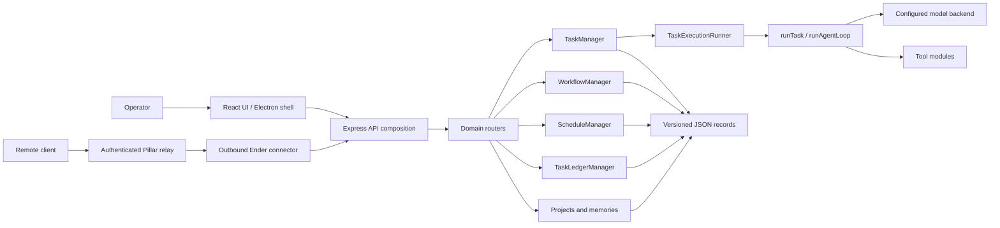

# Architecture Overview

Ender has four primary surfaces:

- the Express API composition and domain routers in `src/api/`;
- the task, workflow, schedule, ledger, editor, and persistence runtime in `src/`;
- the React operator console and Electron shell in `ui/`;
- versioned JSON state on disk, with optional Postgres-backed Pillar and Beacon cloud state.

## High-level component map

## Backend boundaries

[`src/server.js`](../../src/server.js) loads configuration, constructs managers, starts the API, and coordinates bounded shutdown. [`src/api/app.js`](../../src/api/app.js) owns middleware and dependency composition; public endpoints are grouped under [`src/api/routes/`](../../src/api/routes/):

- `systemRoutes.js`: health, workspaces, profiles, filesystem discovery, connector status, and self-update;
- `contextRoutes.js`: projects and memories;
- `automationRoutes.js`: workflows and schedules;
- `taskLedgerRoutes.js`: global task-ledger administration;
- `taskRoutes.js`: task lifecycle, logs, SSE, approvals, and editor sessions.

This split is an ownership boundary, not a public API migration. Compatibility rules and version headers are recorded in [`API_CONTRACTS.md`](../../API_CONTRACTS.md).

## Task execution and lifecycle

[`src/runtime/taskManager.js`](../../src/runtime/taskManager.js) owns task identity, public lifecycle orchestration, event publication, subscriber management, and coordination of persistence, approvals, and execution.

Its extracted collaborators keep the risky boundaries explicit:

- `TaskExecutionRunner` prepares project workspaces and model profiles, then invokes the runtime;
- `TaskApprovalCoordinator` stores and resolves pending approvals;
- `JsonTaskRepository` loads, migrates, serializes, and atomically replaces task records;
- `taskLifecycle.js` defines legal status transitions and terminal outcomes;
- `shutdown.js` bounds cleanup of HTTP intake, schedules, ledger polling, Pillar polling, active runs, and editor sessions.

[`src/runtime/runTask.js`](../../src/runtime/runTask.js) assembles the selected model, memory context, prompt, and tools. [`src/runtime/runAgentLoop.js`](../../src/runtime/runAgentLoop.js) performs iterative model/tool execution until completion, cancellation, stalling, or a configured step limit.

## Automation and context

- `WorkflowManager` persists interactive workflow sessions and renders server-defined `form`, `select`, and `complete` steps. Scheduled workflow replays remain intentionally ephemeral.
- `ScheduleManager` persists cron-backed `prompt`, `thread`, and `workflow` targets.
- `TaskLedgerManager` persists durable queue entries, manual or automatic dispatch policy, attempts, results, and linked task IDs.
- `ProjectManager` and `MemoryManager` persist reusable workspace/project context and global, project, or thread memories.

## Frontend boundary

[`ui/src/App.jsx`](../../ui/src/App.jsx) composes page-level state. Domain hooks own server connection, task collection, transcript, workflow/schedule administration, task-ledger administration, and editor lifecycle. The same React build powers the browser and the sandboxed Electron renderer.

The current information architecture and ownership rules are maintained in [`FRONTEND_ARCHITECTURE.md`](../../FRONTEND_ARCHITECTURE.md).

## Persistence and compatibility

Local state includes threads, projects, memories, schedules, task-ledger entries, workflow sessions, editor sessions, self-update checkpoints, and optional JSON-backed Pillar/Beacon state. Current records use `recordVersion: 1`; compatible legacy records migrate sequentially and unsupported future records are not overwritten.

See [`PERSISTENCE.md`](../../PERSISTENCE.md) for the complete inventory and migration policy.

## Security and deployment boundary

Direct API access defaults to loopback-only enforcement. Docker explicitly opts into open direct access because forwarded host traffic is non-loopback inside the container; that port must stay behind a trusted boundary. Pillar is the authenticated remote-access path and uses an outbound Ender connector, avoiding inbound access to the on-prem API.

See the [release readiness matrix](../../RELEASE_READINESS.md) for tested environments and the [troubleshooting guide](../guides/troubleshooting.md) for operational diagnosis.

## Where to read next

- [Runtime loop and execution lifecycle](runtime-loop.md)
- [Workflows and schedules](workflows-and-schedules.md)
- [Frontend architecture](../../FRONTEND_ARCHITECTURE.md)
- [API contracts](../../API_CONTRACTS.md)
- [Persistence contracts](../../PERSISTENCE.md)
