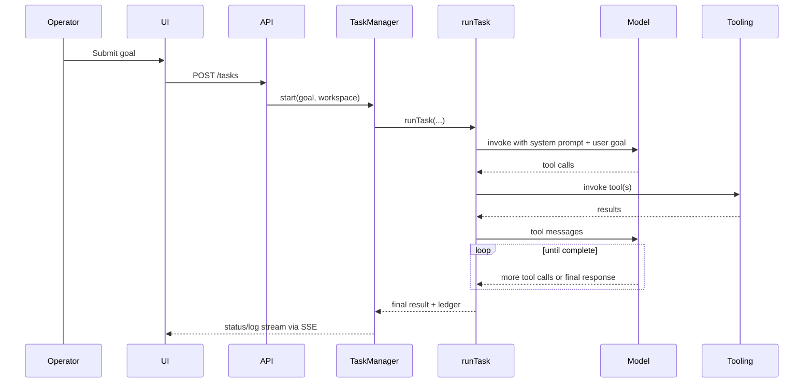
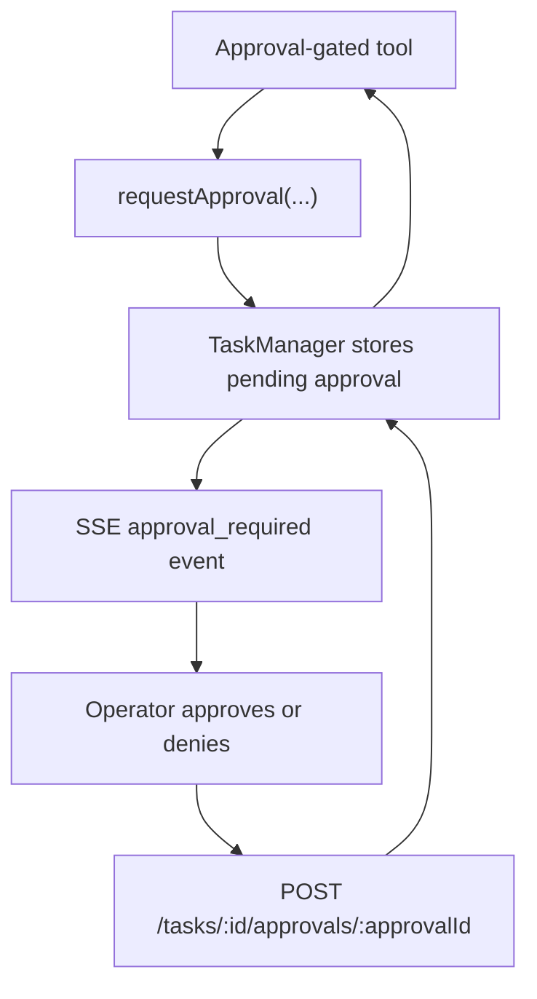

# Runtime Loop and Execution Lifecycle

The core of Ender is the task runtime launched by `TaskManager` and executed by `runTask(...)`.

## End-to-end task lifecycle

## Runtime assembly

[`src/runtime/runTask.js`](../../src/runtime/runTask.js) constructs the execution environment for each task:

- active workspace directory
- model chosen by the thread's `llmProfileId` and `src/llm/factory.js`; the server can keep multiple configured providers and models active concurrently
- optional project and memory context
- tool inventory
- system prompt
- callbacks for logs and approvals

When `LLM_PROFILES_JSON` is unset, `LlmProfileManager` creates a stable default profile for the default `LLM_BACKEND` and each other configured provider, then expands plural model/deployment environment values into deterministic additional profile IDs. The singular value always remains the provider default, preserving saved thread references. An explicit JSON profile list remains authoritative for custom labels, per-profile credentials, and controlled deployments. The selected profile is resolved into a per-run config, so changing providers or models does not mutate global server configuration or require a restart.

The tool inventory includes:

- file tools
- web tools
- git tools
- GitHub and GitLab tools
- Jira, Confluence, Google Drive, and email tools
- schedule tools
- child-thread tools
- project and memory tools
- shell execution
- ledger tools

## Loop behavior

[`src/runtime/runAgentLoop.js`](../../src/runtime/runAgentLoop.js) does the following:

1. Start with a system message and user prompt
2. Bind tools to the model
3. Invoke the model
4. Execute returned tool calls
5. Append tool results as tool messages
6. Repeat until:
   - the model stops returning tool calls
   - a tool returns a `DONE:` result
   - `AGENT_MAX_STEPS` is reached
   - repeated iterations trigger stall detection

## Provider-neutral activity events

Every runtime publishes the same structured activity vocabulary before `TaskManager` persists and streams it. OpenAI, Azure OpenAI, Bedrock, and Ollama share the standard agent loop; ACP maps its protocol updates into the same records.

| Event kind | Purpose |
| --- | --- |
| `run_phase` | Internal model or runtime phase, such as a numbered model request. |
| `assistant_progress` | Human-readable, model-authored progress that belongs in the conversation. |
| `plan` | Structured plan entries and their current state. |
| `tool_call` | One tool lifecycle keyed by `toolCallId`, including provider, name, status, redacted input/output, and locations. |
| `approval` | A human permission decision without exposing its internal approval ID in conversation copy. |
| `chat` | User messages and final assistant responses. |

The UI reduces these records twice: Conversation presents one compact work summary per user turn, while All Activity retains model requests, paired tool details, diagnostics, and timings. Internal phases such as “invoking model” are never represented as assistant speech. Historical string logs are paired and classified by a compatibility adapter in the UI, but all new provider events use the structured contract from `src/runtime/activityEvents.js`.

## Stall detection

The loop fingerprints each iteration based on:

- tool name
- sanitized args
- summarized result content

If the same iteration repeats, Ender increments a repeat counter. Once it reaches `AGENT_STALL_LIMIT`, the task stops with `stall_detected`.

## Approval flow

Some tools call back into the UI for approval.

When the last pending approval is resolved, the task returns to `running`.

## Persistence

`TaskManager` persists task snapshots to `threads/` and reloads them on startup. This includes:

- goal
- thread transcript
- status
- logs
- result
- workspace metadata
- project id, model profile id, and memory loading mode

Workflow sessions are persisted separately in `workflow-sessions/`; scheduled workflow replays remain intentionally ephemeral. Task-ledger entries are also separate records and link to the task ID created for each dispatched run.

For record versions, migration behavior, and the complete storage inventory, see [`PERSISTENCE.md`](../../PERSISTENCE.md).
