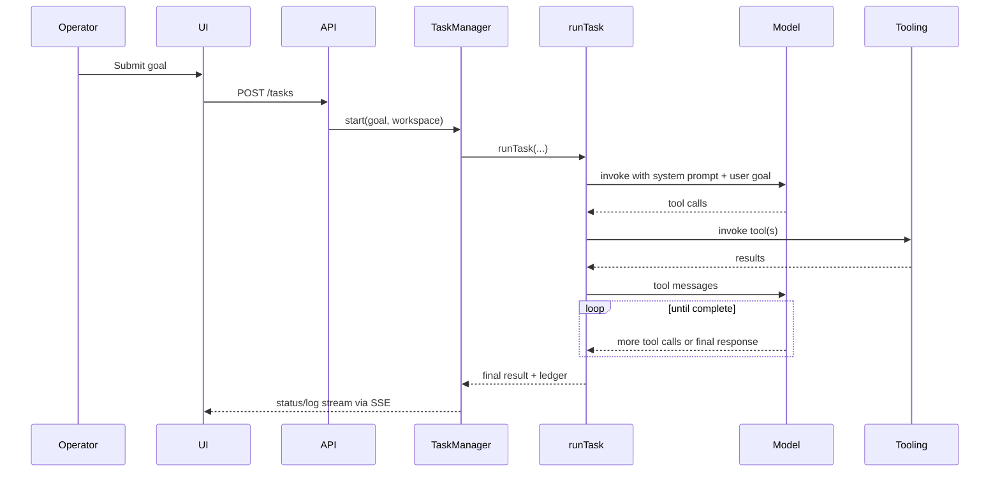
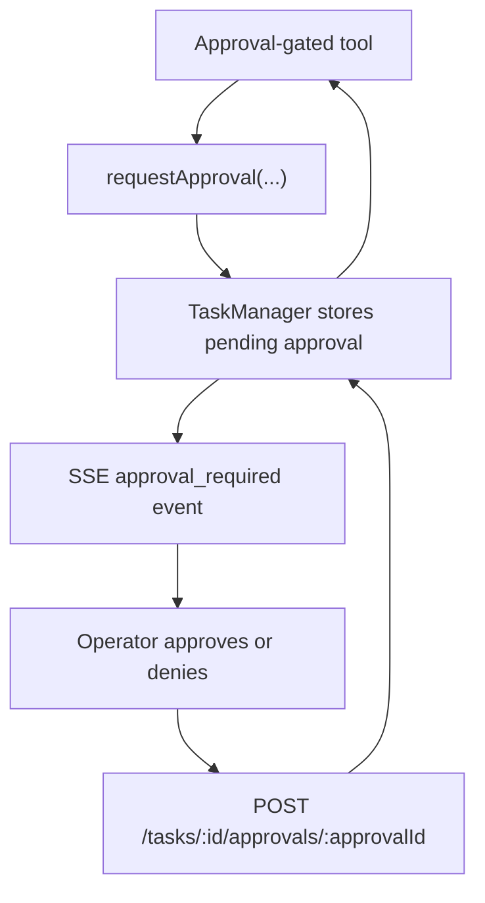

# Runtime Loop and Execution Lifecycle

The core of Ender is the task runtime launched by `TaskManager` and executed by `runTask(...)`.

## End-to-end task lifecycle

## Runtime assembly

[`src/runtime/runTask.js`](../../src/runtime/runTask.js) constructs the execution environment for each task:

- active workspace directory
- model chosen by `src/llm/factory.js`
- tool inventory
- system prompt
- callbacks for logs and approvals

The tool inventory includes:

- file tools
- web tools
- git tools
- GitHub and GitLab tools
- Jira, Confluence, Google Drive, and email tools
- schedule tools
- child-thread tools
- shell execution
- ledger tools

## Loop behavior

[`src/runtime/runAgentLoop.js`](../../src/runtime/runAgentLoop.js) does the following:

1. Start with a system message and user prompt
2. Bind tools to the model
3. Invoke the model
4. Execute returned tool calls
5. Append tool results as tool messages
6. Repeat until:
   - the model stops returning tool calls
   - a tool returns a `DONE:` result
   - `AGENT_MAX_STEPS` is reached
   - repeated iterations trigger stall detection

## Stall detection

The loop fingerprints each iteration based on:

- tool name
- sanitized args
- summarized result content

If the same iteration repeats, Ender increments a repeat counter. Once it reaches `AGENT_STALL_LIMIT`, the task stops with `stall_detected`.

## Approval flow

Some tools call back into the UI for approval.

When the last pending approval is resolved, the task returns to `running`.

## Persistence

`TaskManager` persists task snapshots to `threads/` and reloads them on startup. This includes:

- goal
- thread transcript
- status
- logs
- result
- workspace metadata

Workflow sessions are separate and are not persisted here.

