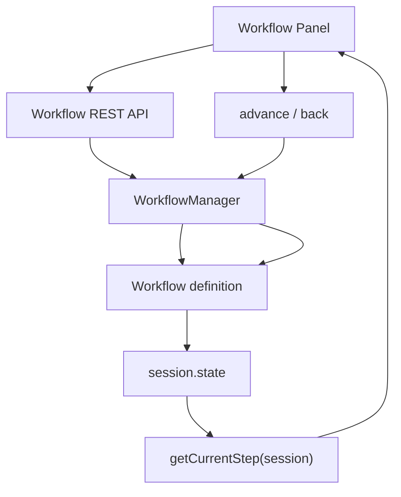
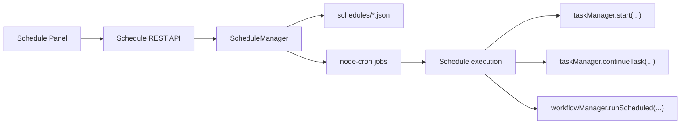
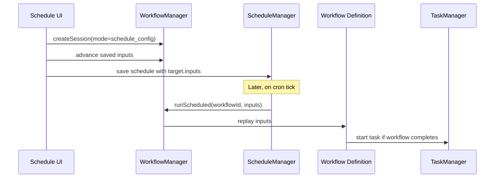

# Workflows and Schedules

Workflows and schedules are the two structured orchestration layers above the raw task runtime.

## Workflow architecture

Workflows are server-defined state machines that emit UI steps.

## Workflow session lifecycle

1. UI requests a new session
2. `WorkflowManager.createSession(...)` calls `createInitialState(...)`
3. The workflow definition returns the first logical state
4. `getCurrentStep(session)` derives the current UI step
5. UI submits structured input
6. `advance(session, input, context)` mutates state
7. If the workflow starts a task, it returns `startedTaskId`

## UI generation model

The frontend does not know specific workflows ahead of time. It renders generic step shapes:

- `form`
- `select`
- `complete`

That means new workflows can usually be added without changing the UI, as long as they stay within the supported step schema.

See:

- [Workflow UI step schema](../reference/workflow-step-schema.md)

## Schedule architecture

Schedules are cron-backed launchers persisted to JSON.

## Workflow schedules

Workflow schedules add one extra layer:

This is why schedulable workflows need to behave well in both modes:

- `interactive`
- `schedule_config`

## Current limitations

- Workflow sessions are in-memory only
- Built-in workflows are registered statically in `src/workflows/index.js`
- The workflow renderer supports a narrow, intentionally simple UI schema

